# [MEMORY GAME](https://primarypigments.github.io/memory-game)

Crazy Memory gives space to critical thinking and that helps children and adults nurture their attention to detail. Memory games can improve visual recognition. With many memory games based on spotting differences, or linking two related images, children and the elderly can improve their visual discrimination.

Here's your deployed site as an example:
https://ui.dev/amiresponsive?url=https://primarypigments.github.io/memory-game

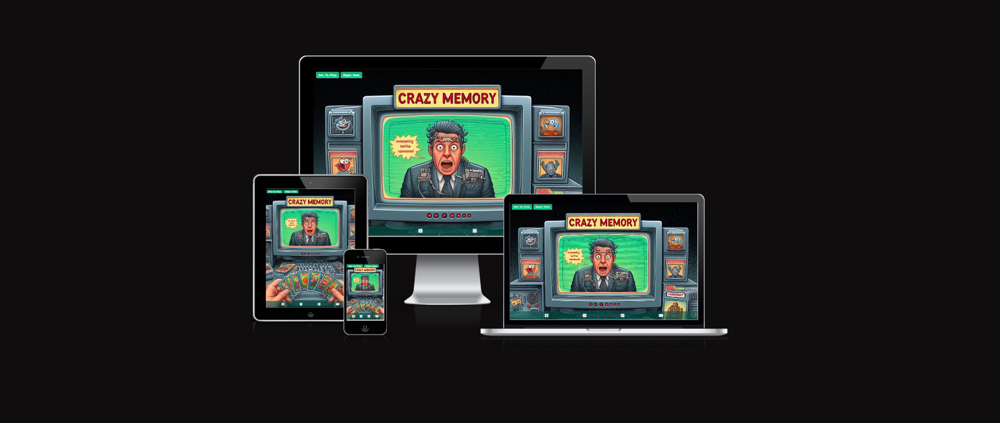

### UX

At this stage of the game I was more concerned about functionality and smooth gameplay than the overall bells and whistles that design can bring. Even though at this stage the design is simple, it is just enough to attract a large array of users to come and play.

### Colour Scheme

I chose colors that would match the hero image due to its appeal of having fun. So the colors I chose are to lour the user to continue and press the begin game button and play.

- Site Colors
- `#f6f7f2` used for primary text.
- `#035349a1` used for Header and footer background.
- `#272b54` used for shadows.
- `#050505` used for background.
- linear-gradient used for Dialog backdrop.
- ´#CE17A3´
- ´#5F2E90´
- ´#196BF0´
- ´#35B135´
- Button Colors
- ´#04AA6D´  
- ´#06e392´ 
- ´#02482e´ used for shadow.
- ´#04AA6D´ used for border.
- ´#449b47´ used for hover background.

When you add a color to the palette, the URL is dynamically updated, making it easier for you to return back to your color palette later if needed.

Example:
https://coolors.co/04aa6d-06e392-449b47-f6f7f2
https://coolors.co/ce17a3-5f2e90-196bf0-ab81cd
https://coolors.co/f6f7f2-035349-272b54-050505

I used [coolors.co](https://coolors.co) to generate my color palette.

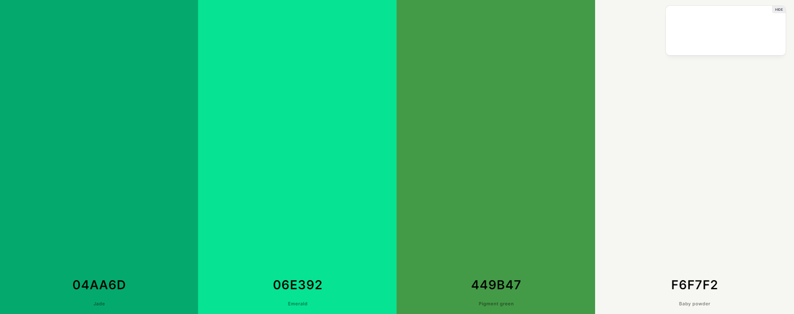
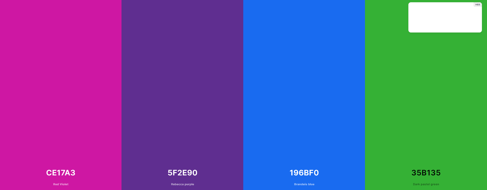
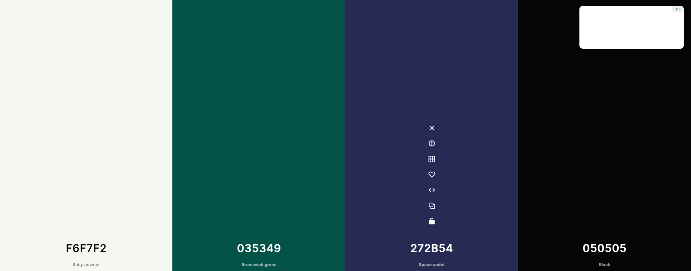

### Typography

Icons

As for icons I decided to use for my website Font Awesome library.

Fonts

I've integrated Google Fonts to find a typeface that compliments the website's aesthetic. For the main text, I've chosen Roboto Mono due to its optimization for readability on screens across a wide variety of devices and reading environments. I've applied with a "sans-serif" fallback.

Example:

- [Rodoto Mono](https://fonts.google.com/specimen/Roboto+Mono) was used for the primary headers and titles.

- [Sans-Serif](https://fonts.google.com/knowledge/glossary/sans_serif) was used as a fallback.

- [Font Awesome](https://fontawesome.com) icons were used throughout the site, such as the social media icons in the footer.

## Wireframes

To follow best practice, wireframes were developed for mobile, tablet, and desktop sizes.
I've used [Balsamiq](https://balsamiq.com/wireframes) to design my site wireframes.

### Mobile Wireframes

 Click here to see the Mobile Wireframes < / summary >

Home
  - 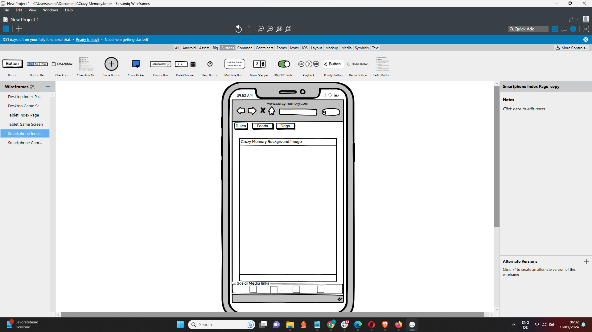

Game Screen
  - 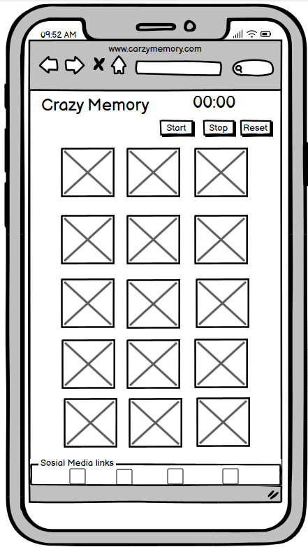

### Tablet Wireframes

 Click here to see the Tablet Wireframes < / summary >

Home
  - 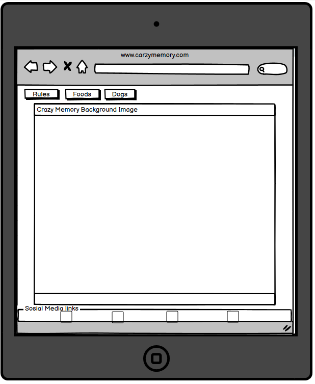

Game Screen
  - ![screenshot]documentation/wireframe/tablet-game.png)

### Desktop Wireframes

 Click here to see the Desktop Wireframes < / summary >

Home
  - ![screenshot]documentation/wireframe/desktop-home.png)

Game Screen
  - 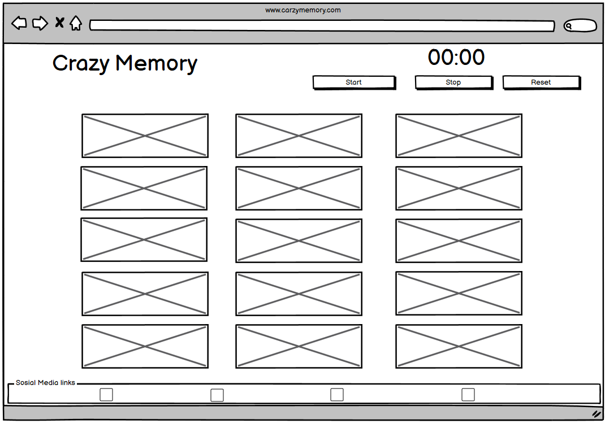

## Features

### Existing Features

- **Hero Image**

    - The Hero image is very captivating and pulls the user in to go further and play the game.

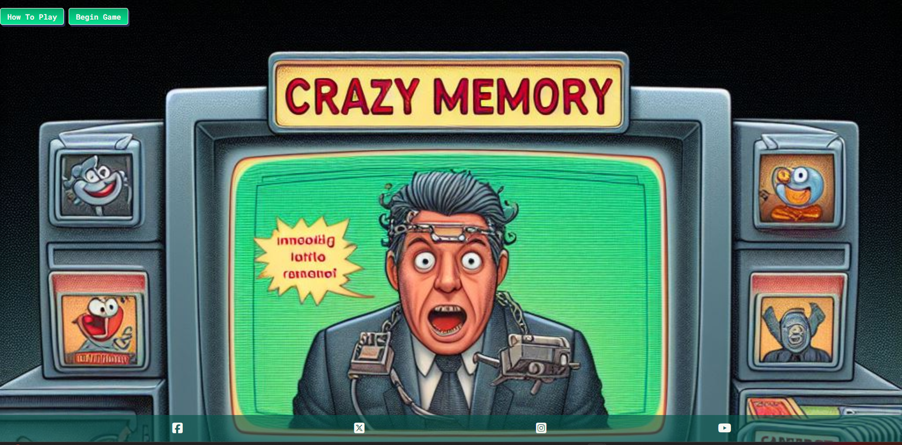

- **Social media accessibility**

    - This gives the user the ability to share our game and share their experience. 

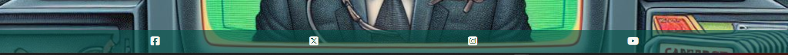

- **Timer**

    - The time give the user the ability to start and unlock the card by pushing the start button. This also stop the user from cheating. By pushing the stop button gives the user the chance to stop the game and take a break. The reset button will reset the game entirely.

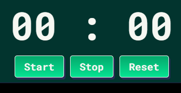

 **Return to home Screen**

    - This gives the user access to return to the home screen to head over the rules again.
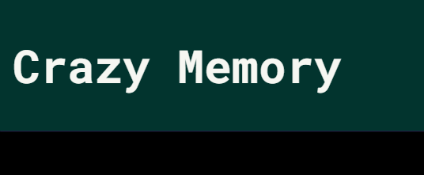

 **2 cards flipped at a time**

    - This stops the users from flipping more than 2 cards at a time.

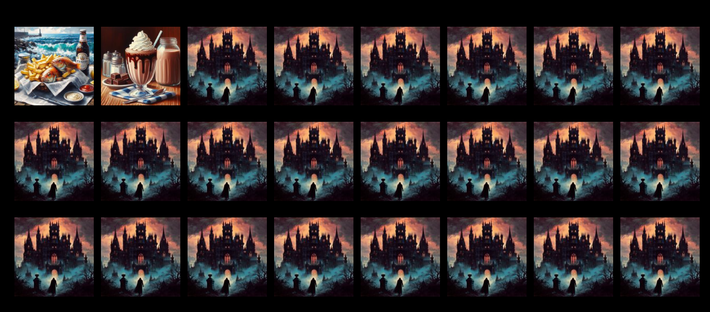

**2 card options Dogs and Foods**

    - This keeps the user on the site longer and gives a more pleasurable game play experience.

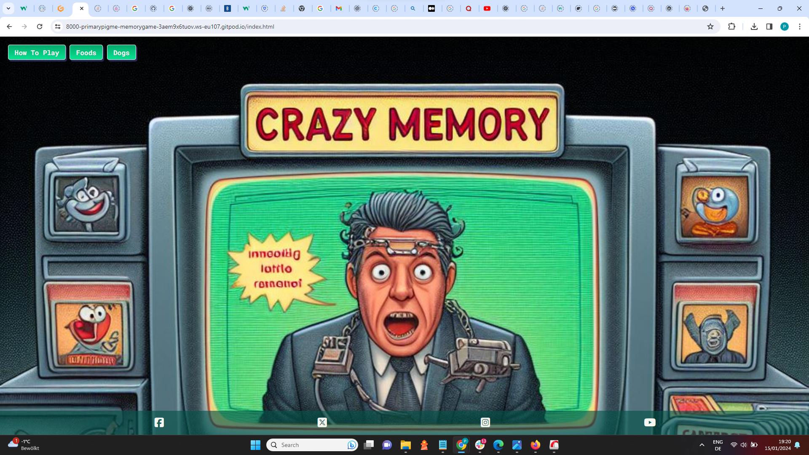

**Locked cards**

    - This keeps the user from cheating the time on the timer.

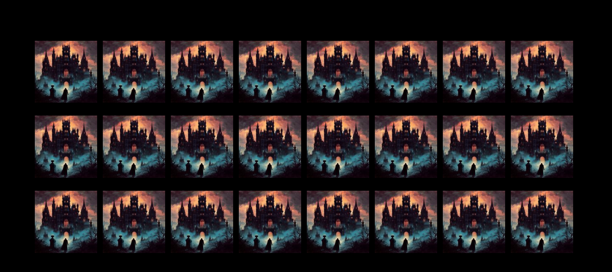

### Future Features

- Animated Card flip  
    -Give the game an overall better feel.
- Ability to Choose different card backs #2
    - Any additional notes about this feature.
- Difficulty ranges 
    - Easy 16 cards, Medium 24 cards, Hard 40 Cards Expert 100 Cards.

## Tools & Technologies Used

- [HTML](https://en.wikipedia.org/wiki/HTML) used for the main site content.
- [CSS](https://en.wikipedia.org/wiki/CSS) used for the main site design and layout.
- [CSS :root variables](https://www.w3schools.com/css/css3_variables.asp) used for reusable styles throughout the site.
- [CSS Grid](https://www.w3schools.com/css/css_grid.asp) used for an enhanced responsive layout.
- [JavaScript](https://www.javascript.com) used for user interaction on the site.
- [JavaScript](https://stackoverflow.com) used as a source to problem solve.
- [GitHub](https://github.com) used for secure online code storage.
- [GitHub Pages](https://pages.github.com) used for hosting the deployed front-end site.
- [Gitpod](https://gitpod.io) used as a cloud-based IDE for development.
- [Google](https://gitpod.io) used as a learning tool

## Testing

For all testing, please refer to the [TESTING.md](TESTING.md) file.

## Deployment

The site was deployed to GitHub Pages. The steps to deploy are as follows:

- In the [GitHub repository](https://github.com/primarypigments/memory-game), navigate to the Settings tab 
- From the source section drop-down menu, select the **Main** Branch, then click "Save".
- The page will be automatically refreshed with a detailed ribbon display to indicate the successful deployment.

The live link can be found [here](https://primarypigments.github.io/memory-game)

### Local Deployment

This project can be cloned or forked in order to make a local copy on your own system.

#### Cloning

You can clone the repository by following these steps:

1. Go to the [GitHub repository](https://github.com/primarypigments/memory-game) 
2. Locate the Code button above the list of files and click it 
3. Select if you prefer to clone using HTTPS, SSH, or GitHub CLI and click the copy button to copy the URL to your clipboard
4. Open Git Bash or Terminal
5. Change the current working directory to the one where you want the cloned directory
6. In your IDE Terminal, type the following command to clone my repository:
	- `git clone https://github.com/primarypigments/memory-game.git`
7. Press Enter to create your local clone.

Alternatively, if using Gitpod, you can click below to create your own workspace using this repository.

Please note that in order to directly open the project in Gitpod, you need to have the browser extension installed.
A tutorial on how to do that can be found [here](https://www.gitpod.io/docs/configure/user-settings/browser-extension).

#### Forking

By forking the GitHub Repository, we make a copy of the original repository on our GitHub account to view and/or make changes without affecting the original owner's repository.
You can fork this repository by using the following steps:

1. Log in to GitHub and locate the [GitHub Repository](https://github.com/primarypigments/memory-game)
2. At the top of the Repository (not top of page) just above the "Settings" Button on the menu, locate the "Fork" Button.
3. Once clicked, you should now have a copy of the original repository in your own GitHub account!

### Local VS Deployment

🛑🛑🛑🛑🛑 START OF NOTES (to be deleted) 🛑🛑🛑🛑🛑

Use this space to discuss any differences between the local version you've developed, and the live deployment site on GitHub Pages.

🛑🛑🛑🛑🛑 END OF NOTES (to be deleted) 🛑🛑🛑🛑🛑

## Credits

### Content

| Source | Location | Notes |
| --- | --- | --- |
| [Markdown Builder](https://tim.2bn.dev/markdown-builder) | README and TESTING | Tool to help generate the Markdown files |
| [Tutor Support](https://learn.codeinstitute.net/ci_support/diplomainfullstacksoftwarecommoncurriculum/tutor) | Entire Site | Tutoring for Project 2 |
| [W3Schools](https://www.w3schools.com/howto/howto_js_topnav_responsive.asp) | Entire Site | Responsive HTML/CSS/JS Buttons |
| [W3Schools](https://www.w3schools.com/howto/howto_css_modals.asp) | End game | Interactive pop-up (modal) |
| [Mmdn web docs](https://developer.mozilla.org/en-US/docs/Web/HTML/Element/dialog) | entire site | how to code dialogs |
| [Stack Overflow](https://stackoverflow.com/questions/2450954/how-to-randomize-shuffle-a-javascript-array) | entire site | How to shuffle an array |
| [Stack Overflow](https://stackoverflow.com/questions/979975/get-the-values-from-the-get-parameters-javascript/979995#979995) | entire site |  How to target the page URL parameters |
| [YouTube]( https://www.youtube.com/watch?v=ec8vSKJuZTk) | entire site | Memory Card game code base |
| [YouTube](https://www.youtube.com/watch?v=ywtkJkxJsdg) | Memory Game | How to use a dialog |
| [YouTube](https://www.youtube.com/watch?v=YL1F4dCUlLc) | leaderboard | using `localStorage()` in JS for high scores |
| [YouTube](https://www.youtube.com/@TechWithNader) |Javascript In Depth | Learn JavaScript Basics |
| [W3schools](https://www.w3schools.com/jsref/met_win_setinterval.asp) | Entire Site | Tutorial for adding Setinterval |
| [Best CSS Button Generator](https://www.bestcssbuttongenerator.com/#/19) | Style´Buttons | In all buttons |
| [W3Schools](https://www.w3schools.com/js/js_timing.asp) | Entire Site | JavaScript Timing Events |
| [Altcademy](https://www.altcademy.com/blog/how-to-disable-a-button-in-javascript/#:~:text=In%20JavaScript%2C%20you%20can%20disable,or%20false%20to%20enable%20it.) | Entire Site | How to disable a button in JavaScript |
| [JS Hint](https://jshint.com/) | Entire Site | JavaScript Errors |

### Media

| Source | Location | Type | Notes |
| --- | --- | --- | --- |
| [Pexels](https://www.pexels.com) | entire site | image | favicon on all pages |
| [Bing Image Creator](https://www.bing.com/images/create?FORM=GENILP) | Entire Site | image | Created all images for site (can not provide links to every image used due  to images are linked to my personal account) |

### Acknowledgements

- I would like to thank my Code Institute mentor, [Tim Nelson](https://github.com/TravelTimN) for their support throughout the development of this project.Tim Really goes the extra mile to get his students to feel confident about their work. I appreciate getting to know him.
- I would like to thank the [Code Institute](https://codeinstitute.net) tutor team for their assistance with troubleshooting and debugging some project issues.
- I would like to thank the [Code Institute Slack community](https://code-institute-room.slack.com) for the moral support; it kept me going during periods of self doubt and imposter syndrome.
- I would like to thank my partner Coleen Sciacca, and my children, for believing in me, and allowing me to make this transition into software development.
- I would like to thank Agnetor für Arbeit, for supporting me in my 
