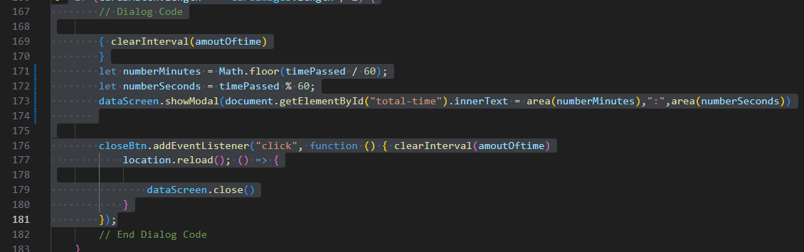

# Testing

## Code Validation

### HTML

I have used the recommended [HTML W3C Validator](https://validator.w3.org) to validate all of my HTML files.

| Page | W3C URL | Screenshot | Notes |
| --- | --- | --- | --- |
| Home | [W3C](https://validator.w3.org/nu/?doc=https%3A%2F%2Fprimarypigments.github.io%2Fmemory-game%2Findex.html) |  | Pass: No Errors |
| Game Screen | [W3C](https://validator.w3.org/nu/?doc=https%3A%2F%2Fprimarypigments.github.io%2Fmemory-game%2Fgamescreen.html) |  | Pass: No Errors |

### CSS

I have used the recommended [CSS Jigsaw Validator](https://jigsaw.w3.org/css-validator) to validate all of my CSS files.

| File | Jigsaw URL | Screenshot | Notes |
| --- | --- | --- | --- |
| style.css | [Jigsaw](https://jigsaw.w3.org/css-validator/validator?uri=https%3A%2F%2Fprimarypigments.github.io%2Fmemory-game) |  | Pass: No Errors |

### JavaScript

I have used the recommended [JShint Validator](https://jshint.com) to validate all of my JS files.

| File | Screenshot | Notes |
| --- | --- | --- |
| script.js |  | 189 Expected an assignment or function call and instead saw an expression.|
| dialog.js |  | Pass: No Errors |
| foods.js |  | Pass: No Errors |
| dogs.js |  | Pass: No Errors |

## Browser Compatibility

I've tested my deployed project on multiple browsers to check for compatibility issues.

| Browser | Home | About | Contact | etc | Notes |
| --- | --- | --- | --- | --- | --- |
| Chrome |  |  |  | Works as expected |
| Firefox |  |  |  | Works as expected |
| Edge |  |  |  | Works as expected |
| Safari |  |  |  | Minor CSS differences |
| Brave |  |  |  | Works as expected |
| Opera |  |  |  | Minor differences |

## Responsiveness

I've tested my deployed project on multiple devices to check for responsiveness issues.

| Device | Home | Gamescreen | Notes |
| --- | --- | --- | --- |
| iPad Pro |  |  | Works as expected |
| Desktop |  |  | Works as expected |
| iPhone 15 Pro Max |  |  | Works as expected |

## Lighthouse Audit

I've tested my deployed project using the Lighthouse Audit tool to check for any major issues.

| Page | Mobile | Desktop | Notes |
| --- | --- | --- | --- |
| Home |  |  | Some minor warnings |
| Game Screen |  |  | Some minor warnings |

## Bugs

- JS Dialog missprinting correct time format

    

    - To fix this, I concatenated the string on the line before I show the modal.
    - I used use the '+' operator for string concatenation instead of the commas. Then I assign it to a variable, and then set the innerText on the element to that variable.

- JS After making a match, the matched card are not disabled.

    

    - To fix this, I used onclick in my initial code, then i learned that onclick is not reliable in JS and can cause errors or unwanted behavior, so i switched "onclick" to "click" and the game started to work properly.

- JS After pressing stop button cards are not disabled

    

    - To fix this, I first tried to create an if statement and disable the cards once the start button was pressed. I found this to cause a series of problems that I didn't find a solution to. Then i tried to simplify this by disabling the board. I called the board class
 in the “eventlistener” for the stop button and added a disabled class to the board and then in “eventlistener” for the start button I removed disable.

- JS More than 2 cards can be clicked

    

    - To fix this, I created a loop through images and disabled them (to avoid more than 2 being clicked at a time). After this I added a delay to reactivate the cards.

- Python `E501 line too long` (93 > 79 characters)

    

    - To fix this, I _____________________.

## Unfixed Bugs

🛑🛑🛑🛑🛑 START OF NOTES (to be deleted) 🛑🛑🛑🛑🛑

You will need to mention unfixed bugs and why they were not fixed.
This section should include shortcomings of the frameworks or technologies used.
Although time can be a big variable to consider, paucity of time and difficulty understanding
implementation is not a valid reason to leave bugs unfixed.

If you've identified any unfixed bugs, no matter how small, be sure to list them here.
It's better to be honest and list them, because if it's not documented and an assessor finds the issue,
they need to know whether or not you're aware of them as well, and why you've not corrected/fixed them.

Some examples:

🛑🛑🛑🛑🛑 END OF NOTES (to be deleted) 🛑🛑🛑🛑🛑

- On devices smaller than 375px, the page starts to have `overflow-x` scrolling.

    

    - Attempted fix: I tried to add additional media queries to handle this, but things started becoming too small to read.

- For PP3, when using a helper `clear()` function, any text above the height of the terminal does not clear, and remains when you scroll up.

    

    - Attempted fix: I tried to adjust the terminal size, but it only resizes the actual terminal, not the allowable area for text.

- When validating HTML with a semantic `section` element, the validator warns about lacking a header `h2-h6`. This is acceptable.

    

    - Attempted fix: this is a known warning and acceptable, and my section doesn't require a header since it's dynamically added via JS.

🛑🛑🛑🛑🛑 START OF NOTES (to be deleted) 🛑🛑🛑🛑🛑

If you legitimately cannot find any unfixed bugs or warnings, then use the following sentence:

🛑🛑🛑🛑🛑 END OF NOTES (to be deleted) 🛑🛑🛑🛑🛑

There are no remaining bugs that I am aware of.
